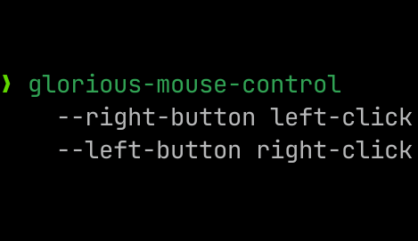

# glorious-mouse-control



CLI control for Glorious Model D and Model O (wired) mice on Linux.

Currently provides control for

- [x] DPI Presets
- [x] DPI Colors
- [x] Selected DPI
- [x] Liftoff distance
- [x] Debounce Time
- [x] RGB
- [ ] Button Mapping
  - [x] Standard Mouse Buttons
  - [ ] Media controls, etc... (logged but not implemented)

## Install

### Prerequisites:

- [Rust Toolchain](https://rustup.rs) (you need this to run `cargo` and build the project)
- [Libusb](https://libusb.info/) (you probably have this already, if not it should be in your package manager)

### Quick install

```sh
cargo install --git https://github.com/outfoxxed/glorious-mouse-control
```

### Local build\*

```sh
git clone https://github.com/outfoxxed/glorious-mouse-control
cd glorious-mouse-control
cargo install --path .
```

\*The quick install method will also run a local build

## Usage

### Warning: running glorious-mouse-control will reset all your mouse settings.

Running this program will replace your mouse's entire config with the one you have defined.

Every time you change an option with CLI flags, your saved configuration will be updated
along with the configuration on your mouse. If you run the program again previously applied
settings will be reapplied.

You can find all of the flags and information about them with `glorious-mouse-control --help`.
Also see the [Usage Examples](#usage-examples)

You can also change the configuration by editing `~/.config/glorious-mouse-control/config.json`

## Common problems

```
error: could not open device: Access denied (insufficient permissions)
```

You may need to run the program as root, or grant write access to your mouse some other way.

## Usage Examples

Apply the current configuration:

```sh
glorious-mouse-control // no arguments
```

Set one DPI and select it

```sh
glorious-mouse-control --reset-dpis --enable-dpi 0 --dpi 0:1100 --dpi-color 0:ffffff --select-dpi 0
```

Enable RGB in Breathing mode with custom colors

```sh
glorious-mouse-control --mode breathing --breathing-color 0:ff0000 --breathing-color 1:00ff00 --breathing-color 2:0000ff --breathing-color 3:ff00ff --breathing-color 4:ffff00 --breathing-color 5:00ffff --breathing-color 6:ffffff --breathing-speed 3
```

Disable RGB

```sh
glorious-mouse-control --mode off
```

Set the DPI button to middle-click

```sh
glorious-mouse-control --dpi-button middle-click
```

## Docker Usage

In case you don't feel like installing rust/cargo on your system, you can run glorious-mouse-control in a docker container. You will need to give the container `--privileged` tag though.

1. Build the docker image

```sh
docker build -t glorious-mouse-control .
```

2. Run the container

```sh
docker run --rm -it --privileged -v "$(pwd):/app" glorious-mouse-control --help
```

> [!NOTE]
> You can replace `$(pwd)` with an absolute file path to persist your build between runs. Or you can just run the container without the volume mount if you want to build it each time. Example usage:
>
> ```sh
> docker run --rm -it --privileged glorious-mouse-control --help
> ```
